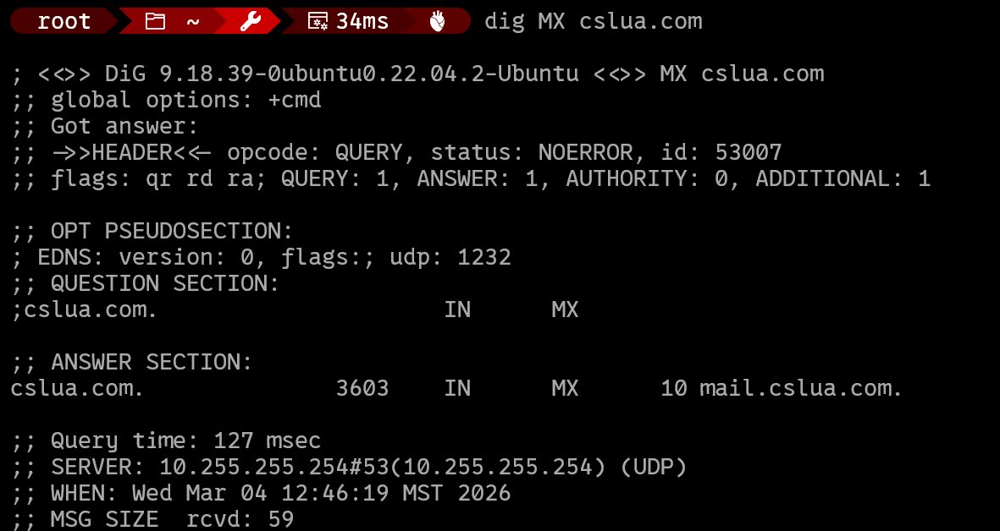
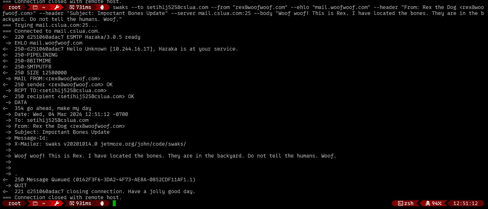
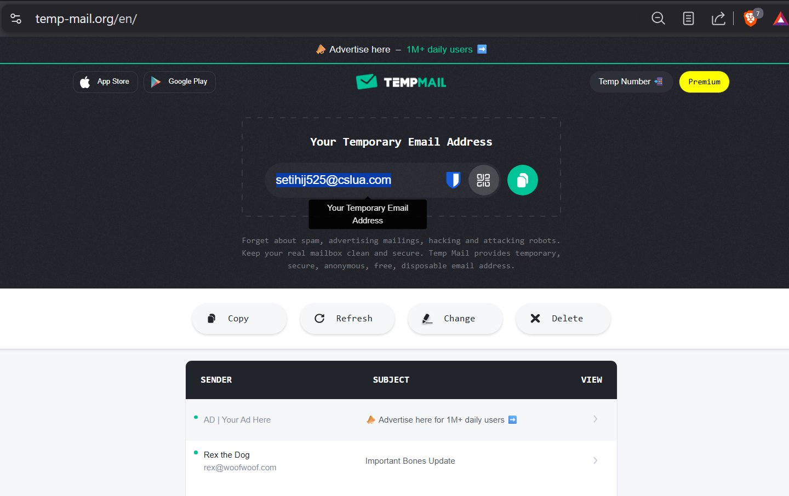
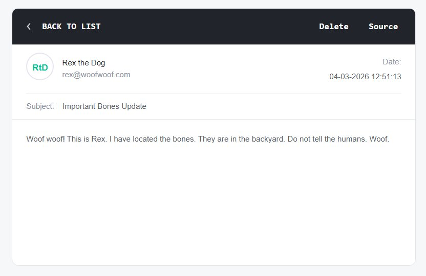

# Email Spoofing Lab: How Easy It Is (and How to Stop It) PART1

This lab walks through a real spoofing attack from scratch — finding a target inbox, 
looking up its mail server, and delivering a spoofed email with a completely fake sender 
identity. The goal is to demonstrate how trivially easy this is when a domain has no 
email authentication records, and to motivate locking down your DNS.

> ⚠️ **This lab is for educational purposes only. Only test domains and inboxes you own 
> or have explicit permission to test.**

---

## Tools Required

First download Swaks (Swiss Army Knife for SMTP).  It is a command-line tool for testing and troubleshooting SMTP (email) servers.
It lets you send test emails directly from the terminal with full control over every part of the transaction — headers, body, authentication, encryption, etc. It's mainly used by sysadmins and developers to verify that a mail server is working correctly.
Common things you can do with it:

- Send a test email to verify an SMTP server is accepting connections
- Test SMTP authentication (login, plain, CRAM-MD5, etc.)
- Test TLS/SSL connections
- Simulate different sending scenarios (spoofed from address, custom headers, attachments)
- Debug mail relay configurations

```bash
# Install swaks (the Swiss Army Knife of SMTP)
apt install swaks -y

# Verify
swaks --version
```

---

## Step 1: Get a Temporary Target Inbox

Go to [temp-mail.org](https://temp-mail.org) and grab a disposable email address. 
![[tempmail-inbox02.png]]

For this lab we used:

```
setihij525@cslua.com
```

This gives us a real inbox we control with no consequences if it gets spammed.

---

## Step 2: Look Up the Mail Server

Before you can deliver email you need to know which server accepts mail for the domain. 
That's what the MX (Mail Exchanger) DNS record is for.

```bash
dig MX cslua.com
```



The answer section shows:

```
cslua.com.    3603    IN    MX    10 mail.cslua.com.
```

`mail.cslua.com` is the server that accepts email for this domain. The `10` is the 
priority — lower numbers are tried first. Now we know exactly where to aim swaks.

---

## Step 3: Send the Spoofed Email

Now we send an email to our temp inbox, claiming to be from `rex@woofwoof.com` — 
a domain that doesn't exist. We also spoof the EHLO greeting to make our connecting 
server appear to be `mail.woofwoof.com`.

```bash
swaks \
  --to setihij525@cslua.com \
  --from "rex@woofwoof.com" \
  --ehlo "mail.woofwoof.com" \
  --header "From: Rex the Dog <rex@woofwoof.com>" \
  --header "Subject: Important Bones Update" \
  --server mail.cslua.com:25 \
  --body "Woof woof! This is Rex. I have located the bones. They are in the backyard. Do not tell the humans. Woof."
```

**What each flag does:**

| Flag                  | Purpose                                                                     |
| --------------------- | --------------------------------------------------------------------------- |
| `--to`                | SMTP envelope recipient — who the server delivers to                        |
| `--from`              | SMTP envelope sender (`MAIL FROM`) — what SPF checks                        |
| `--ehlo`              | Spoofed hostname sent in the EHLO greeting                                  |
| `--header "From:"`    | Display name shown in the email client — completely independent of `--from` |
| `--header "Subject:"` | Overrides swaks' auto-generated subject                                     |
| `--server`            | Which mail server to connect to directly                                    |
| `--body`              | Plain text message body                                                     |



The key lines in the output:

```
-> EHLO mail.woofwoof.com          ← we claimed to be woofwoof.com
<- Hello Unknown [10.244.16.17]    ← server saw our real IP anyway
-> MAIL FROM:<rex@woofwoof.com>    ← fake envelope sender
<- 250 sender <rex@woofwoof.com> OK  ← accepted without question
<- 250 Message Queued              ← delivered
```

The server accepted the fake sender with no authentication whatsoever.

---

## Step 4: Check the Inbox





The email arrived cleanly showing:

- **From:** Rex the Dog `<rex@woofwoof.com>`
- **Subject:** Important Bones Update
- **Body:** The full dog message

From the recipient's perspective this looks completely legitimate. There is no warning, 
no "on behalf of", no indication that `woofwoof.com` doesn't exist or that the sender 
was never authenticated.

---

## Why This Works: The Envelope vs. Header Gap

SMTP was designed in 1982 with no authentication. There are two completely separate 
"from" fields in every email:

```
SMTP Envelope (MAIL FROM)    →  used by servers for routing and SPF checks
                                invisible to end users

Message Header (From:)       →  what email clients display to users
                                trivially fakeable, no verification by default
```

These two fields have **no required relationship to each other**. A receiving server 
has no built-in way to verify that the connecting client is actually authorized to send 
on behalf of the domain in `MAIL FROM` — unless the domain has published DNS records 
that tell receiving servers what to do.

---

## The Three DNS Records That Stop This

### SPF (Sender Policy Framework)
Published as a TXT record on the domain. Lists which IP addresses are authorized to 
send email on behalf of the domain. If a server connects claiming to be `woofwoof.com` 
but its IP isn't in the SPF record, the receiving server knows it's unauthorized.

```
TXT  woofwoof.com  "v=spf1 include:_spf.google.com ~all"
```

### DKIM (DomainKeys Identified Mail)
A cryptographic signature added to outgoing messages by the sending mail server. 
The public key is published in DNS. Receiving servers verify the signature — if it 
doesn't match, the message was either spoofed or tampered with in transit.

```
TXT  selector._domainkey.woofwoof.com  "v=DKIM1; k=rsa; p=<public key>"
```

### DMARC (Domain-based Message Authentication Reporting and Conformance)
Ties SPF and DKIM together and tells receiving servers what to **do** when checks fail. 
Without DMARC, even a failed SPF check might still result in delivery. DMARC gives 
the domain owner control.

```
TXT  _dmarc.woofwoof.com  "v=DMARC1; p=reject; rua=mailto:dmarc@woofwoof.com"
```

The `p=reject` policy means: **reject any email that fails SPF or DKIM alignment**. 
This is what actually stops spoofing. `p=none` (the default when no record exists) 
just monitors and reports — it doesn't block anything.

---

## Checking a Domain's Defenses

```bash
# Check SPF
dig TXT yourdomain.com | grep spf

# Check DMARC
dig TXT _dmarc.yourdomain.com

# Check DKIM (substitute your selector, e.g. "google" or "default")
dig TXT google._domainkey.yourdomain.com
```

If any of these return no results, the domain is vulnerable to spoofing.

---

## Coming Next: Locking Down Your Domain in Cloudflare

The next section of this lab will walk through adding SPF, DKIM, and DMARC records 
in Hostinger to properly protect a domain against exactly the attack demonstrated 
above.

---

All test emails were sent to disposable inboxes with no third parties affected.*
